<div align="center">
  
</div>

<br />

<div align="center">
  <a href="https://crag.web.app"></a>
  &nbsp;
  <a href="https://contactraghav.web.app"></a>
  &nbsp;
  <a href="https://www.linkedin.com/in/raghav-goyal-linkd/"></a>
  &nbsp;
  <a href="mailto:goyalraghav1289@gmail.com"></a>
</div>

<br />

---

### Visual Demonstrations & Systems Architecture

<div align="center">
  <a href="https://contactraghav.web.app"></a>
  &nbsp;
  <a href="https://github.com/raghavatgit/StreamShield"></a>
</div>

<br />

---

### Capabilities & Architecture Family Tree

```text
Raghav Goyal (Core Capabilities)
├── 1. Full-Stack Web Architecture & Creative Design [PRODUCTION READY]
│   ├── Responsive SPAs & PWAs (React, Next.js, Modern CSS3, Vanilla ES6+)
│   ├── 3D Spatial Interfaces & WebGL (Real-time CSS3 Matrix Math, Canvas)
│   ├── High-Conversion Landing Pages (Clean Typography, Mobile-First Grids)
│   └── Modern Web APIs (WebSockets, MediaSession, Web Audio DSP)
│
├── 2. Native Desktop & App Development [WIN32 / KERNEL]
│   ├── Cross-Platform Applications (Rust, Tauri, TypeScript)
│   ├── Windows OS Utilities (Win32 APIs, Desktop Stream Isolation)
│   ├── Lightweight Footprint Architecture (Sub-25 MB Resident Memory)
│   └── Audio & System Companion Tools (Custom Webpack Injection, IPC Bridges)
│
└── 3. Algorithms & Data Systems [ALGORITHMIC SUITE]
    ├── 100+ Solved Algorithmic Problems (Rust, C++, TypeScript)
    ├── Data Structures & Design Patterns (Trees, Graphs, DSU, Monotonic Stacks)
    ├── Backend & Distributed Storage (Firebase, Google Cloud Platform, Node.js)
    └── Developer Tooling (PowerShell Profiles, Diagnostic Telemetry)
```

---

### Freelance Services & Client Solutions

- **Full-Stack Web Design & Prototyping**: Engineering bespoke, modern web applications, high-converting product landing pages, and interactive 3D spatial web experiences with zero bloated dependencies.
- **Native Desktop App Development**: Building high-efficiency desktop utilities and lightweight tools using Rust, Tauri, and TypeScript with minimal resource consumption.
- **End-to-End MVP Delivery**: Transforming product ideas into deployed, fully functional prototypes with automated CI/CD and edge cloud deployment on GCP and Firebase.

---

### Featured Architectures & Client Solutions

| Project | Status | Domain | Stack | Overview | Links |
| :--- | :--- | :--- | :--- | :--- | :--- |
| **[ContactMe](https://github.com/raghavatgit/ContactMe)** | `[Live MVP]` | 3D Spatial Web Portal | Vanilla JavaScript, CSS3 3D Matrix | Interactive personal portal calculating real-time cursor velocity and perspective transforms without third-party graphics engines. | [Launch 3D Portal ->](https://contactraghav.web.app) \| [Code](https://github.com/raghavatgit/ContactMe) |
| **[StreamShield](https://github.com/raghavatgit/StreamShield)** | `[Native Utility]` | Native Windows Desktop | Rust, Tauri, Win32 API, React | Privacy window isolation utility that masks sensitive desktop applications from capture pipelines in real time. | [Inspect Architecture ->](https://github.com/raghavatgit/StreamShield) |
| **[vencord-ytm-player](https://github.com/raghavatgit/vencord-ytm-player)** | `[Desktop Client]` | Desktop Client Extension | TypeScript, React, Web Audio API | Persistent YouTube Music companion player with logarithmic audio normalization, queue ring buffers, and Discord RPC. | [Inspect Client ->](https://github.com/raghavatgit/vencord-ytm-player) |
| **[Zenflow-3D](https://github.com/raghavatgit/Zenflow-3D)** | `[Spatial Prototype]` | Kinetic Motion Prototype | JavaScript, CSS3 Perspectives | Deep focus spatial interface implementing multi-layered CSS perspective planes and tactile card physics. | [Inspect Prototype ->](https://github.com/raghavatgit/Zenflow-3D) |
| **[FoodStaticWebs](https://github.com/raghavatgit/FoodStaticWebs)** | `[Commercial Web]` | Commercial Web Design | HTML5, CSS3 Grid, Responsive | Modern responsive culinary web design templates and digital menus with fluid layouts and high performance. | [Inspect Layouts ->](https://github.com/raghavatgit/FoodStaticWebs) |
| **[dsa-patterns](https://github.com/raghavatgit/dsa-patterns)** | `[100+ Solutions]` | Algorithms & Complexity | Rust, C++, TypeScript | Curated library of 100+ algorithmic problem solutions with formal complexity proofs and unit test harnesses. | [Explore Problem Suite ->](https://github.com/raghavatgit/dsa-patterns) |
| **[til](https://github.com/raghavatgit/til)** | `[110+ Notes]` | Engineering Knowledge Base | Systems, Databases, Networking | Architectural notes on distributed systems, databases, operating systems, and network protocols. | [Browse System Notes ->](https://github.com/raghavatgit/til) |

---

### Technical Proficiencies

| Domain | Technologies & Tools |
| :--- | :--- |
| **Languages** | C, C++, Rust, Python, TypeScript, JavaScript, SQL, HTML5, CSS3 |
| **Frontend & Design** | React, Next.js, Modern CSS3, Responsive Layouts, WebGL, WebSockets |
| **Native & Systems** | Tauri, Windows API, Linux, Shell Scripting, Git |
| **Cloud & Backend** | Google Cloud Platform (GCP), Firebase, Node.js, Distributed Storage |

---

### Freelance Delivery Workflow

```text
[1. Discovery & Architecture]  --->  [2. Engineering & Polish]  --->  [3. Edge Deployment & Launch]
Wireframing & UX Ergonomics         Type-safe Code (Rust/TS/React)    Global CDN (Firebase/Vercel/GCP)
Responsive Layout Systems           Zero Unnecessary Dependencies     Automated CI/CD Integration
Performance & SEO Goals             Micro-interactions & Speed         Clean Handoff & Documentation
```

---

### Engineering Activity & Telemetry

| Metric | Overview | Focus Area |
| :--- | :--- | :--- |
| **Annual Activity** | 720+ Contributions (Active Streak) | Algorithmic Problem Solving & Systems Development |
| **Problem Solutions** | 100+ Production-Grade Solutions | Rust, C++, TypeScript ([dsa-patterns](https://github.com/raghavatgit/dsa-patterns)) |
| **Systems & Architecture** | 110+ Technical Engineering Notes | Linux VFS, Distributed Systems, Networking ([til](https://github.com/raghavatgit/til)) |
| **Active Codebases** | 11 Public Repositories | Desktop Utilities, Web Audio DSP, Spatial 3D Web |

---

### Contact & Collaboration

Whether you are looking for a responsive full-stack web application, a custom native desktop utility, or an end-to-end prototype:

- **Portfolio**: [crag.web.app](https://crag.web.app)
- **Interactive Portal**: [contactraghav.web.app](https://contactraghav.web.app)
- **LinkedIn**: [linkedin.com/in/raghav-goyal-linkd](https://www.linkedin.com/in/raghav-goyal-linkd/)
- **Email**: [goyalraghav1289@gmail.com](mailto:goyalraghav1289@gmail.com)
